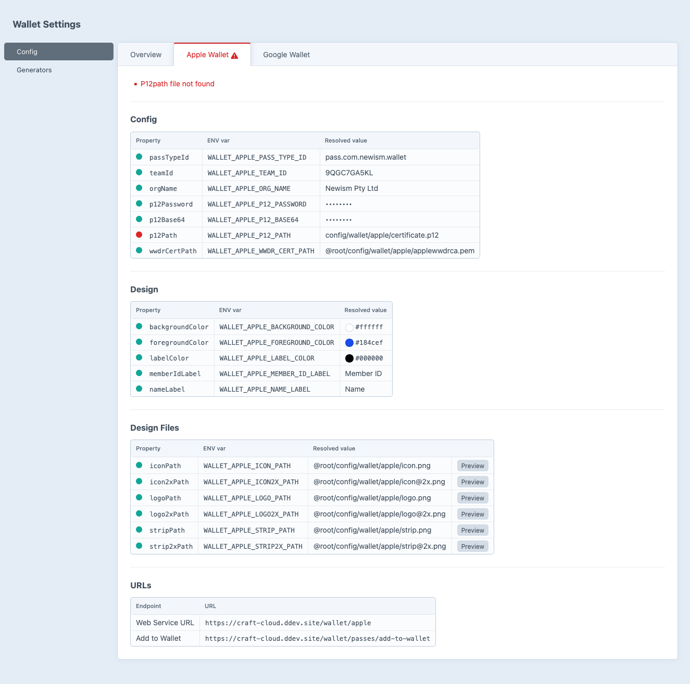

# Configuration

Configuration is managed through `config/wallet/wallet.php` and environment variables. A starter config directory should have been automatically copied to `config/wallet/` on installation with placeholder images and README guides for each platform.

Before configuring settings, you'll need to set up your Apple and Google credentials. See the [Setup guide](./setup) for step-by-step instructions for both [Apple Wallet](./setup#_1-apple-wallet) and [Google Wallet](./setup#_2-google-wallet).

## Configuration Debugging

The plugin provides a comprehensive configuration debugging page that shows the resolved settings values for both Apple and Google Wallet, including which values are coming from config files and which are coming from environment variables. This is a great way to verify that your configuration is set up correctly and that your credentials are being read properly.



## Configuration options

All settings can also be set via environment variables. ENV vars always take precedence over config file values.

Property names are mapped to env vars automatically using `SNAKE_CASE` with a prefix:

- **Apple Wallet:** `WALLET_APPLE_` prefix (e.g. `passTypeId` → `WALLET_APPLE_PASS_TYPE_ID`)
- **Google Wallet:** `WALLET_GOOGLE_` prefix (e.g. `issuerId` → `WALLET_GOOGLE_ISSUER_ID`)

## Apple Wallet Settings

### Identifiers

:::config
setting: passTypeId
env: WALLET_APPLE_PASS_TYPE_ID
type: string
default: —
---
Pass Type Identifier (e.g. `pass.com.example.membership`)
:::

:::config
setting: teamId
env: WALLET_APPLE_TEAM_ID
type: string
default: —
---
Apple Developer Team ID
:::

:::config
setting: orgName
env: WALLET_APPLE_ORG_NAME
type: string
default: —
---
Organisation name displayed on the pass
:::

### Credentials

:::config
setting: p12Password
env: WALLET_APPLE_P12_PASSWORD
type: string
default: —
---
Password for the `.p12` certificate
:::

:::config
setting: p12Base64
env: WALLET_APPLE_P12_BASE64
type: string
default: —
---
Base64-encoded `.p12` certificate (serverless)
:::

:::config
setting: p12Path
env: WALLET_APPLE_P12_PATH
type: string
default: '@root/config/wallet/apple/certificate.p12'
---
Path to P12 certificate (set to empty when using `p12Base64`)
:::

:::config
setting: wwdrCertPath
env: WALLET_APPLE_WWDR_CERT_PATH
type: string
default: '@root/config/wallet/apple/applewwdrca.pem'
---
Path to WWDR CA certificate
:::

### Design

:::config
setting: backgroundColor
env: WALLET_APPLE_BACKGROUND_COLOR
type: string
default: '#ffffff'
---
Pass background color (hex)
:::

:::config
setting: foregroundColor
env: WALLET_APPLE_FOREGROUND_COLOR
type: string
default: '#184cef'
---
Text color (hex)
:::

:::config
setting: labelColor
env: WALLET_APPLE_LABEL_COLOR
type: string
default: '#000000'
---
Label text color (hex)
:::

:::config
setting: memberIdLabel
env: WALLET_APPLE_MEMBER_ID_LABEL
type: string
default: 'Member ID'
---
Header field label
:::

:::config
setting: nameLabel
env: WALLET_APPLE_NAME_LABEL
type: string
default: 'Name'
---
Secondary field label
:::

### Images

:::config
setting: iconPath
env: WALLET_APPLE_ICON_PATH
type: string
default: '@root/config/wallet/apple/icon.png'
---
Path to icon image
:::

:::config
setting: icon2xPath
env: WALLET_APPLE_ICON2X_PATH
type: string
default: '@root/config/wallet/apple/icon@2x.png'
---
Path to retina icon
:::

:::config
setting: logoPath
env: WALLET_APPLE_LOGO_PATH
type: string
default: '@root/config/wallet/apple/logo.png'
---
Path to logo image
:::

:::config
setting: logo2xPath
env: WALLET_APPLE_LOGO2X_PATH
type: string
default: '@root/config/wallet/apple/logo@2x.png'
---
Path to retina logo
:::

:::config
setting: stripPath
env: WALLET_APPLE_STRIP_PATH
type: string
default: '@root/config/wallet/apple/strip.png'
---
Path to strip image
:::

:::config
setting: strip2xPath
env: WALLET_APPLE_STRIP2X_PATH
type: string
default: '@root/config/wallet/apple/strip@2x.png'
---
Path to retina strip
:::

## Google Wallet Settings

### Identifiers

:::config
setting: issuerId
env: WALLET_GOOGLE_ISSUER_ID
type: string
default: —
---
Google Wallet Issuer ID
:::

:::config
setting: orgName
env: WALLET_GOOGLE_ORG_NAME
type: string
default: —
---
Card title / organisation name
:::

:::config
setting: classSuffix
env: WALLET_GOOGLE_CLASS_SUFFIX
type: string
default: 'membership'
---
Pass class suffix
:::

### Credentials

:::config
setting: serviceAccountJsonBase64
env: WALLET_GOOGLE_SERVICE_ACCOUNT_JSON_BASE64
type: string
default: —
---
Base64-encoded service account JSON (serverless)
:::

:::config
setting: serviceAccountJsonPath
env: WALLET_GOOGLE_SERVICE_ACCOUNT_JSON_PATH
type: string
default: '@root/config/wallet/google/service-account.json'
---
Path to service account JSON (set to empty when using `serviceAccountJsonBase64`)
:::

### Design

:::config
setting: backgroundColor
env: WALLET_GOOGLE_BACKGROUND_COLOR
type: string
default: '#ffffff'
---
Card background color (hex)
:::

:::config
setting: subHeader
env: WALLET_GOOGLE_SUB_HEADER
type: string
default: 'Member'
---
Sub-header text below user's name
:::

:::config
setting: memberIdLabel
env: WALLET_GOOGLE_MEMBER_ID_LABEL
type: string
default: 'Member ID'
---
Text module header label
:::

### Images

:::config
setting: logoPath
env: WALLET_GOOGLE_LOGO_PATH
type: string
default: '@root/config/wallet/google/logo.png'
---
Path to logo image
:::

:::config
setting: heroPath
env: WALLET_GOOGLE_HERO_PATH
type: string
default: '@root/config/wallet/google/hero.png'
---
Path to hero image
:::

## Config File Example

Create `config/wallet/wallet.php` to set defaults. Env vars will still override any values set here.

```php
use newism\wallet\models\AppleSettings;
use newism\wallet\models\GoogleSettings;

return [
    'apple' => AppleSettings::create()
        ->passTypeId('pass.com.example.membership')
        ->teamId('XXXXXXXXXX')
        ->orgName('My Organisation')
        ->backgroundColor('#000000')
        ->foregroundColor('#d4af37')
        ->labelColor('#a98c2c')
        ->memberIdLabel('Member ID')
        ->nameLabel('Name'),

    'google' => GoogleSettings::create()
        ->issuerId('3388000000022229999')
        ->orgName('My Organisation')
        ->classSuffix('membership')
        ->backgroundColor('#000000')
        ->subHeader('Gold Member')
        ->memberIdLabel('Member ID'),
];
```

## Craft Cloud / Serverless Environments

In serverless environments like [Craft Cloud](https://craftcms.com/cloud) you can't upload files to the server. Instead, store sensitive credentials as base64-encoded environment variables.

Run the setup command to base64-encode your credentials and write them to `.env`:

```bash
php craft wallet/setup/env-base64
```

This reads the files at `apple.p12Path` and `google.serviceAccountJsonPath` from your resolved settings, base64-encodes them, and appends (or updates) the following block in your `.env`:

```env
###> newism/craft-wallet ###
WALLET_APPLE_P12_BASE64="MIIKYgIBAzCCCi..."
WALLET_GOOGLE_SERVICE_ACCOUNT_JSON_BASE64="eyJ0eXBlIjoic2VydmljZV9hY2NvdW50Ii..."
###< newism/craft-wallet ###
```

When these env vars are set, the plugin uses them automatically. The `certificate.p12` and `service-account.json` files are not needed on the server.

Since the credential files won't exist in cloud environments, set the corresponding path properties to empty via environment variables to avoid file-not-found errors on the settings page:

```env
WALLET_APPLE_P12_PATH=""
WALLET_GOOGLE_SERVICE_ACCOUNT_JSON_PATH=""
```

You can re-run the command any time you update your credentials.
